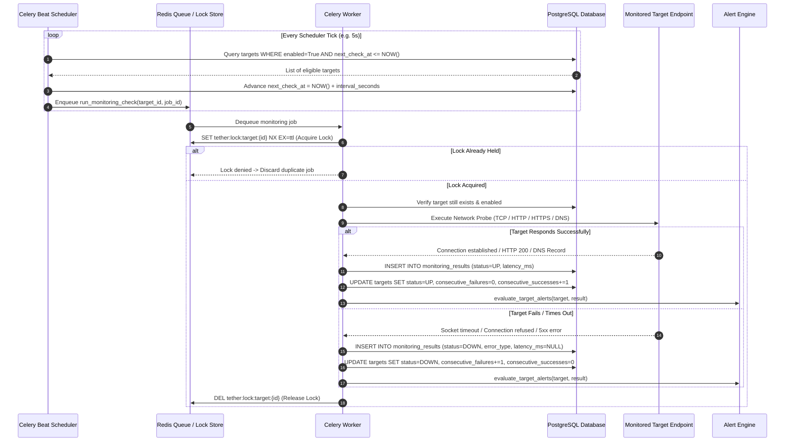

# Tether — Monitoring & Probe Execution Sequence

This document details the turn-by-turn sequence diagram and execution flow for periodic network monitoring, probe execution, database persistence, and failure recovery.

---

## 1. Scheduled Monitoring Sequence Diagram

---

## 2. Step-by-Step Execution Lifecycle

1. **Scheduling Query**: Celery Beat runs periodic dispatcher tasks. It scans PostgreSQL for enabled targets due for inspection (`next_check_at <= now`).
2. **Interval Advance**: Before task enqueueing, Beat advances `next_check_at` to prevent repeated scheduling in the subsequent tick.
3. **Queue Ingestion**: Monitoring jobs enter the Redis FIFO queue.
4. **Concurrency Safety**:
   - The worker attempts an atomic `SET key val NX EX 30` in Redis.
   - If another worker is currently checking that same target, the task terminates immediately with zero duplicate network impact.
5. **Protocol Strategy Execution**:
   - Probes operate with a strict non-blocking timeout ($1.0\text{s} - 30.0\text{s}$).
   - Socket connections and HTTP sessions use ephemeral connection pooling to avoid socket exhaustion (`TIME_WAIT`).
6. **Persistence & Metrics**:
   - Every probe result is committed to `monitoring_results` with high-resolution latency timestamps.
   - Target state counters (`consecutive_failures`, `consecutive_successes`) are updated atomically.
   - Queue wait time ($\Delta t_{\text{queue}}$) and probe execution duration ($\Delta t_{\text{exec}}$) are recorded in Prometheus histograms.
7. **Alert Evaluation**: The alert engine evaluates the updated target status against configured rules.
